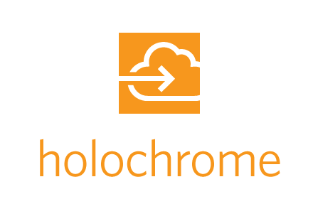

## This is an AdRoll Group-specific fork. Check upstream for a public version. 

<p align="center"><a href="https://chrome.google.com/webstore/detail/holochrome/fgnplojdffjfbcmoldcfdoikldnogjpa"></a></p>

| Browser  |  Version | Downloads  | Rating  |
|---|---|---|---|
|Chrome| [](https://chrome.google.com/webstore/detail/holochrome/fgnplojdffjfbcmoldcfdoikldnogjpa)|[](https://chrome.google.com/webstore/detail/holochrome/fgnplojdffjfbcmoldcfdoikldnogjpa)|[](https://chrome.google.com/webstore/detail/holochrome/fgnplojdffjfbcmoldcfdoikldnogjpa)|
|FireFox|[](https://addons.mozilla.org/en-US/firefox/addon/bw-holochrome/)|[](https://addons.mozilla.org/en-US/firefox/addon/bw-holochrome/)|[](https://addons.mozilla.org/en-US/firefox/addon/bw-holochrome/)|

Holochrome is a chrome extension that allows you to easily log in and switch between your AWS accounts using a single key stroke. It is built on top of the [aws instance metadata service](http://docs.aws.amazon.com/AWSEC2/latest/UserGuide/ec2-instance-metadata.html) and therefore encourages security best practices by completely removing the need for static, long-lived credentials. The AWS console session is granted the exact same permissions as the [IAM role](http://docs.aws.amazon.com/AWSEC2/latest/UserGuide/iam-roles-for-amazon-ec2.html) available via the metadata service.

# How do I get it?

Chrome: [Chrome Web Store](https://chrome.google.com/webstore/detail/holochrome/fgnplojdffjfbcmoldcfdoikldnogjpa)

Firefox: [Mozilla Add-on Store](https://addons.mozilla.org/en-US/firefox/addon/bw-holochrome)

# How do I use it?

Either click the icon or use the keyboard shortcut:

Mac: `Cmd+Shift+1`

Win: `Ctrl+Shift+1`

The keyboard shortcut is a 'global' listener which will bring Chrome into focus once pressed.

Chrome allows you to modify the keyboard shortcut on the chrome://extensions page. Check out [this guide](http://www.howtogeek.com/127162/how-to-create-custom-keyboard-shortcuts-for-browser-actions-and-extensions-in-google-chrome/) for more details.

# How do I get the instance metadata service?

If you run a machine in AWS with an IAM role, it will exist by default and things should run smoothly.

If you want to leverage Holochrome on your local development machine, check out [AdRoll's Hologram](https://github.com/AdRoll/hologram).


# Developing

Follow the Chrome Development Guidelines for [loading an unpacked extension](https://developer.chrome.com/extensions/getstarted#unpacked). Target the inner holochrome/ folder.

To run tests:

```
cd test && npm install && npm test
```

## TODO

1. Potentially support the [default credential provider chain](http://docs.aws.amazon.com/AWSSdkDocsJava/latest/DeveloperGuide/credentials.html) to allow the AWS console to more closely mimic other AWS services.
